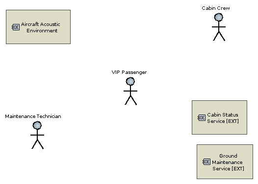
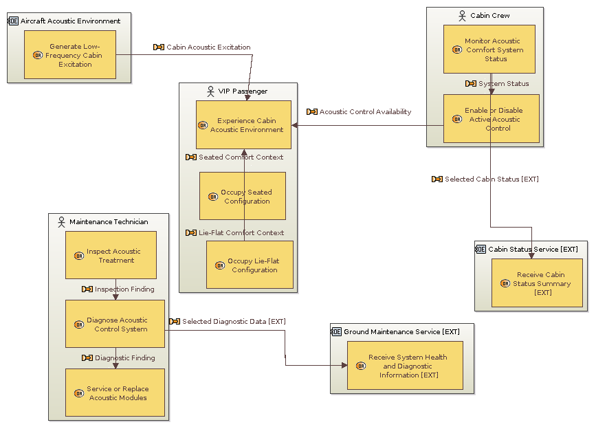
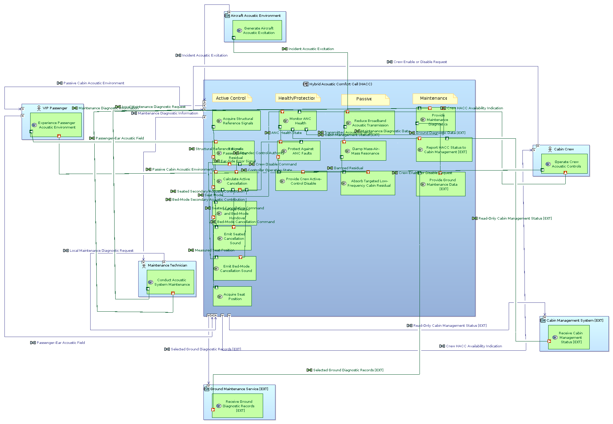
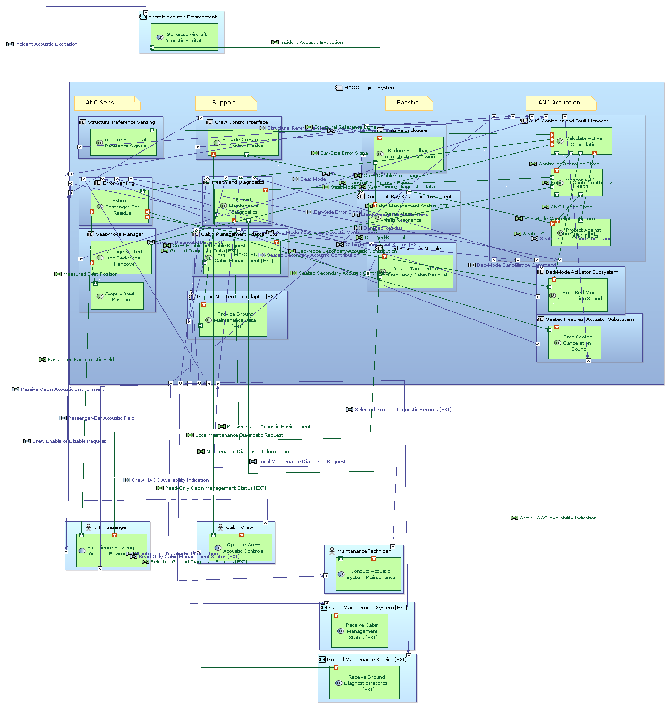
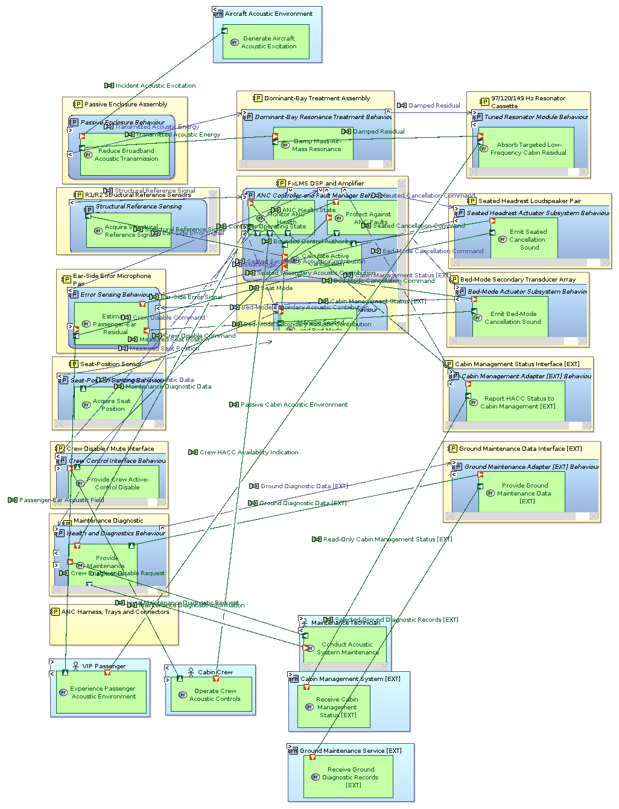
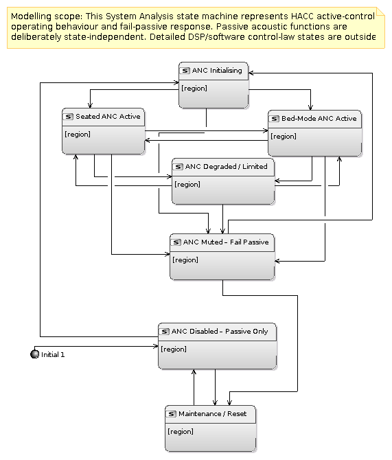
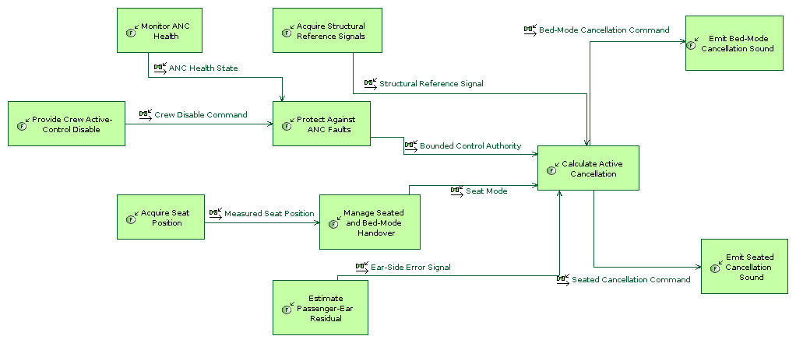

# HACC Cabin MBSE Demonstrator

**Capella 7.1.0 · ARCADIA · Aircraft cabin acoustic comfort · End-to-end traceability**

This portfolio project translates the Hybrid Acoustic Comfort Cell (HACC) concept
developed by KPR LuxAero for Lufthansa Technik InnovAero 2026 into an end-to-end
Capella architecture. It connects the operational need for passenger acoustic
comfort to system functions, logical responsibilities, physical implementation,
operating modes, requirement constraints and a verification programme.

The model uses two origin tags:

- **BASE** — architecture derived from the HACC Final Technical Report.
- **EXT** — a representative read-only cabin-status interface and selected
  ground-maintenance diagnostic reporting added to demonstrate system-boundary
  extension and traceability.

## Portfolio evidence

| Model evidence | Content |
|---|---:|
| Native Capella representations | 18 |
| Operational processes and functional chains | 12 |
| Requirement and stakeholder-need constraints | 19 |
| Functional exchanges | 87 |
| Component exchanges | 72 |
| Component ports / port realizations | 126 / 175 |
| Physical behaviour-to-node deployments | 14 |
| ANC operating states / transitions | 7 / 18 |
| Verification cases | 16 across G1–G5 and EXT |

The project demonstrates:

- operational analysis of passengers, crew, maintenance and the aircraft
  acoustic environment;
- system, logical and physical decomposition across the ARCADIA layers;
- functional allocation, cross-layer realization and boundary delegation;
- passive treatment, tuned resonator and dual-mode active-control architecture;
- seated, bed-mode, degraded, muted and fail-passive operating behaviour;
- requirements represented through native Capella constraints and a
  requirements-to-architecture traceability matrix;
- verification planning from material characterisation to matched cruise testing.

## Architecture views

### Operational context



### Operational architecture



### System architecture and external interactions



### Logical architecture and functional allocation



### Physical architecture and deployment



### ANC operating and fail-passive behaviour



### Active-control functional chain



The `.aird` session contains all 18 editable native representations, including
operational, system, logical and physical functional-chain descriptions.

## Engineering basis

The BASE architecture captures the HACC configuration defined in the Final
Technical Report:

- six-face 2.0 kg/m² limp-mass barrier;
- 100 mm melamine treatment on upper faces and 25 mm under the floor;
- 125 mm fully filled dominant bay with local constrained-layer damping and a
  +1.0 kg/m² barrier overlay;
- serviceable 97/120/149 Hz resonator cassette;
- seated 2×2×2 feedforward ANC with a bed-mode secondary array;
- fail-passive operation, crew disable, health monitoring and diagnostics;
- 135.0 kg passive concept mass and 147.5 kg with the active system before growth.

The report's conservative active-control allocation gives predicted seated and
reclined 200 Hz levels of 55.3–60.1 dB(A) and 60.1–62.1 dB(A), respectively.
Balanced broadband screening estimates are 73.2–78.1 dB(A) seated and
78.0–80.1 dB(A) reclined. These are model-based design estimates; the repository's
verification cases define the evidence required to validate them.

See [Engineering basis](docs/engineering_basis.md) and
[Model scope](docs/model_scope.md).

## Traceability and verification

Requirements and stakeholder needs are represented by 19 native Capella
`Constraint` objects. Each constraint links directly to the functions,
logical components and physical elements it governs. The mass constraint is
anchored to the HACC physical system; installation constraints are anchored to
the enclosure and isolation hardware.

- [Requirements register](requirements/requirements.csv)
- [Requirements-to-architecture traceability](requirements/traceability_matrix.csv)
- [Component-exchange register](interfaces/component_exchanges.csv)
- [Verification cases](verification/verification_cases.csv)
- [Verification strategy](verification/README.md)

Engineering verification is planned. The registers identify intended evidence
and do not represent laboratory, flight-test or certification results.

## Repository structure

```text
HACC-Cabin-MBSE-Demonstrator/
├── README.md
├── LICENSE
├── model/HACC_MBSE_Architecture/
│   ├── .project
│   ├── HACC_MBSE_Architecture.afm
│   ├── HACC_MBSE_Architecture.capella
│   └── HACC_MBSE_Architecture.aird
├── diagrams/
├── requirements/
├── interfaces/
├── verification/
├── docs/
└── qa/
```

## Open in Capella

1. Install **Capella 7.1.0**.
2. Select `File → Import → General → Existing Projects into Workspace`.
3. Choose **Select root directory** and select
   `model/HACC_MBSE_Architecture` from this repository.
4. Import the project and open `HACC_MBSE_Architecture.aird`.

The `.capella`, `.aird`, `.afm` and `.project` files use their canonical Capella
names and belong together. Detailed instructions are in
[Opening the project](docs/opening_in_capella.md).

## Project scope

The portfolio covers passenger acoustic comfort, passive transmission treatment,
resonator integration, ANC sensing/control/actuation, seat-mode handover,
fail-passive behaviour, crew control, system health, maintainability and the
explicitly tagged EXT status/diagnostic boundaries.

Detailed aircraft-network protocols, proprietary cabin-management internals,
certified wiring design, production installation drawings and executable ANC
software are outside the project scope.

This is an independent engineering portfolio project. It does not represent an
Airbus or Lufthansa Technik product architecture and contains no proprietary
aircraft-system data.

## Author

**Glen Mthandeni Ndlovu**  
B.E. Mechatronics Engineering — Robotics Specialization  
[GitHub profile](https://github.com/glennmthandeni)

